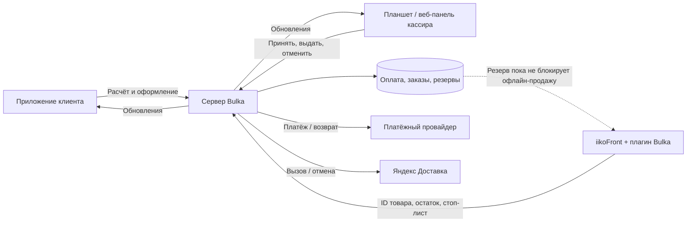

# Проверка схемы Bulka — приложение, касса, планшет

Дата: 10 сентября 2026. Проверены исходники сервера, приложения, веб-панели,
плагина iikoFront, SQL-ограничения и автоматические тесты. Проверка на физической
кассе отложена владельцем до установки плагина. Это не подтверждение испытаний
на рабочей кассе, банковском терминале или у реального курьера.

## Главный вывод

Переименования и переводы не мешают синхронизации: используется ID товара.
Но синхронизация количества сама по себе не связывает онлайн-заказ с чеком кассы.
Сейчас онлайн-заказ повторно пробивается вручную как «Безналичный».
Такой способ оплаты не сообщает Bulka, какой именно онлайн-заказ был пробит.

До добавления явной связи заказа Bulka и чека iikoFront нельзя обещать единую
защиту последней единицы между офлайн-кассой и интернетом или автоматическое
распознавание повторного начисления бонусов.

Дополнение: по запросу владельца онлайн-продажа оставляет на точке одну
единицу каждого товара с заданным остатком. Из количества вычитаются действующие
онлайн-резервы и ещё 1 штука; ограничение действует в каталоге и SQL-оформлении,
включая восстановление резерва при поздней оплате. При остатке 1 онлайн-продажа
недоступна, при 6 доступно не больше 5. Касса продолжает видеть физическое количество.
Это ограничение не заменяет общий резерв: одновременная офлайн-продажа нескольких
единиц по-прежнему может пересечься с онлайн-заказом.

## Текущая схема

## Обнаруженные ошибки и исправления

| Сценарий | Что было | Исправление |
| --- | --- | --- |
| Стоп-лист на планшете | Переключение стоп-листа также замораживало количество в ручном режиме | Стоп действует отдельно; количество продолжает поступать из Front. Ручной источник включается при явном вводе количества |
| Повтор старого оформления при потере связи | Проверка свежести была только при вставке нового резерва | Проверка также действует при продлении / восстановлении активного резерва |
| Товар профиля Астаны | ID `astana:<UUID>` не проходил проверку прав кассира в URL | Разрешены обычный и URL-кодированный префикс; вложенные пути по-прежнему запрещены |
| Отмена на экране кухни | Возврат ожидал уже отменённого курьера | Экран кухни вызывает общий процесс: отменить курьера, подтвердить отмену, затем вернуть оплату |

Исправления касаются сервера и одинаково применяются к запросам приложения,
планшета и веб-панели. Для них добавлены регрессионные тесты.

## Незакрытые риски общей схемы

### 1. Последняя единица одновременно на кассе и в приложении — критично

Между двумя онлайн-покупателями SQL-блокировка даёт один успешный резерв.
Но офлайн-продажа не обращается к этому резерву. Если касса продаёт последний
товар между резервированием и оплатой в приложении, последующая проверка
может обнаружить нехватку и оформить возврат. Она не гарантирует наличие товара
к выдаче. Между событиями Front и сервером также существует задержка сети.

Нужен протокол резервирования с подтверждением главной кассы до оплаты клиента.
Он должен учитывать конкретный онлайн-заказ, срок резерва, отмену, повтор
запроса и перезапуск. Само уменьшение стоп-листа по таймеру этого не решает:
при пробитии уже зарезервированного заказа можно получить второе списание.

### 2. Онлайн-заказ и «Безналичный» чек — критично

Платёж Bulka имеет собственный идентификатор; бонусы POS имеют отдельный ключ
на основе филиала и ID чека iiko. Совпадение суммы, номера телефона или времени
не считается надёжным доказательством, что это одна покупка.

Если кассир повторно привяжет бонусного клиента к вручную пробитому онлайн-чеку,
возможно повторное начисление или применение бонусной скидки. Обычная
идемпотентность защищает от повтора одного запроса, но не от двух разных ID.

Нужна явная взаимно однозначная привязка `заказ Bulka ↔ чек iikoFront` с проверкой
филиала и состава. При ней оплата и бонусы уже оплаченного онлайн-заказа должны
учитываться один раз. Отдельный тип оплаты «Bulka онлайн» полезен для кассира,
но сам по себе без ID заказа проблему не закрывает.

### 3. Выдача только на планшете без пробития в iiko — критично

При выдаче планшет снимает онлайн-резерв. Для источника Front Bulka специально
не списывает количество второй раз. Если чек в iiko не пробили, проданное
количество может снова стать доступным в приложении.

После введения привязки из пункта 2 выдача должна учитывать подтверждение
кассового учёта. До этого требуется соблюдение ручного процесса: каждый
онлайн-заказ пробить один раз в iiko, не начисляя повторно бонусы.

### 4. Ручной режим и восстановление кассы

Если Front не отвечает 45 секунд, новые заказы по его неподтверждённым остаткам
блокируются. Кассир может пересчитать товар и ввести число в Bulka. Возврат
к Front — отдельное подтверждение. После офлайн-продаж во время ручного режима
число в Bulka само не узнает о них: требуется пересчёт или восстановление обмена.

Это запасной способ управления при отказе кассы, пока доступен сервер Bulka.
Он не обеспечивает работу приложения без интернета. Загрузка каталога также
зависит от меню iikoCloud и его кеша: отказ этого источника нужно проверять
отдельно от отказа самого iikoFront.

### 5. Неучтённые товары, размеры и вес

Пустое количество в количественном стоп-листе означает отсутствие ограничения,
а не ноль. Остаток нужно задать для каждой ограниченной позиции. «Свой товар»,
созданный отдельно в Bulka, не привязывается к iiko по названию.
Текущая модель штучная; остатки разных размеров одной позиции сводятся к минимуму.
Перед использованием весовых товаров или нескольких размеров нужен отдельный
учёт единиц и вариантов. Используемый API работает с товаром и его размером:
[документация iikoFront](https://iiko.github.io/front.api.doc/2023/05/03/stop-list-edit.html).

## Что уже защищено и проверено

| Область | Защита и предел проверки |
| --- | --- |
| Разные названия товара | Стабильный ID сохраняется при переименовании; похожие имена не объединяются |
| Остатки филиалов | Филиал определяется учётной записью кассира или отдельным ключом POS; чужую точку нельзя выбрать в теле запроса |
| Два планшета | Смена статуса сравнивает исходный статус; повторное принятие возвращает первое подтверждение, не вызывает второго курьера |
| Две правки количества | Ревизия предотвращает перезапись нового остатка старой формой; отмена подтверждения не сохраняет изменения |
| Обновления | События обновляют каталог, заказ и экран кассира; публичным клиентам не передаются адреса и личные данные чужих заказов |
| Поздняя оплата | Перед началом исполнения повторно проверяются резервы; при недоступности предусмотрена отмена и возврат |
| Возврат | Используются идентификатор запроса и состояние `processing/unknown/succeeded`; неопределённый ответ провайдера не считается новым поводом для второго возврата |
| Курьер | Принятие доставки запускает общий серверный процесс; перед возвратом проверяется подтверждённая отмена внешней заявки |
| Адрес | Дом, подъезд, этаж, квартира и инструкции сохраняются отдельными полями и передаются в комментарий курьеру; реальную метку нужно сверять на карте |
| Стоимость доставки | Клиент платит подтверждённый расчёт; последующее изменение тарифа не увеличивает его платёж |
| Бюджет Яндекса | Bulka резервирует внутренний бюджет с запасом. Это не блокировка денег внутри Яндекса: ручные траты вне Bulka требуют сверки остатка |
| Бонусы онлайн | Не более 50% стоимости товаров после скидок; доставка не оплачивается бонусами. Остаток бонусов резервируется на сервере |
| Сессии | Восстановление сессии и параллельные обновления покрыты тестами; сетевой тайм-аут не равен выходу из аккаунта. Отзыв доступа и выход должны прекращать сессию |
| Push кассиру | Сервер повторяет напоминания, пока заказ не принят. ОС не гарантирует показ пуша строго каждые 3 секунды; это не замена постоянно открытому экрану заказов |

## Проверка перед включением общей схемы на точке

Сначала нужно реализовать следующие части протокола. Это проект решения,
а не описание уже установленных функций плагина 1.3.0:

1. Сервер присваивает онлайн-заказу постоянный ID. На кассе заказ выбирают
   по номеру или сканированием; сервер проверяет филиал, состав, оплату и
   отсутствие другого связанного чека. Обычный чек «Безналичный» без выбора
   онлайн-заказа остаётся отдельной продажей.
2. Перед оплатой Bulka получает подтверждение резерва от главной кассы.
   Офлайн-продажа обязана учитывать этот резерв. Если выбранный механизм iiko
   допускает обход ограничения кассиром, его нельзя считать строгой защитой:
   нужны подходящие права и проверка сценария на используемой версии iikoFront.
3. Связанный кассовый чек закрывает тот же резерв один раз. Уже проведённые
   в Bulka оплата, списание и начисление бонусов не запускаются повторно в POS.
   Планшет показывает связь и состояние чека, чтобы выдача не скрывала
   незавершённый кассовый учёт.
4. Отмена, возврат, истечение резерва и повторная доставка события имеют
   постоянные ключи операций. При потере ответа сначала проверяется исходная
   операция. Неизвестное состояние не означает, что действие можно повторить
   как новую продажу или освободить занятый товар.
5. После восстановления связи сверяются незавершённые заказы, чеки и резервы.
   Расхождения попадают в список для кассира; ручной пересчёт не удаляет
   обязательства по уже оплаченным заказам.

После реализации протокола и установки на тестовой точке:

1. Проверить версию iikoFront и назначение главного терминала, ключи именно
   этого филиала, отображение ID товара и штучную единицу измерения.
2. Продать 5 из 10 обычному покупателю, проверить 5 в приложении и на планшете.
3. Одновременно оформить последнюю единицу с двух телефонов; затем отдельно
   проверить соревнование телефона с кассой — этот сценарий нельзя считать
   закрытым до двустороннего резервирования.
4. Один оплаченный онлайн-заказ пробить ровно одним связанным чеком. Сверить
   товар, оплату, бонусы и остаток; проверить повтор и перезапуск плагина.
5. Принять один заказ одновременно на двух планшетах: один курьер, одно
   принятие. Отменить его: одна отмена курьера, один возврат, один возврат бонусов.
6. Отключить связь кассы; проверить блокировку новых неподтверждённых остатков,
   ручной пересчёт, восстановление и явный возврат управления Front.
7. Проверить сбой во время оплаты, ответа банка, пробития и выдачи. После
   восстановления у заказа должен остаться один итоговый результат.

Для плагина сохранён один комплект: поиск/регистрация клиента, бонусы,
подарочные сертификаты, код выдачи и обмен остатками. Ключи в архив не включены;
при установке сохраняется конфигурация действующей кассы.

## Результаты автоматических проверок

Для текущих исправлений полный `npm run verify`: 959 серверных тестов прошли,
3 пропущены; 307 тестов веб-панели прошли. Проверки контрактов, миграций,
линтеры, сборка и ограничения размера сборки пройдены. SQL-сценарии проверяются
на локальной тестовой базе, без изменения клиентских заказов.

Для предшествующего выпуска интеграции дополнительно проверены 9 тестов
Flutter, анализ Flutter без замечаний, сборка плагина без предупреждений,
веб-каталог из 167 позиций на ширинах 390, 768 и 1365 пикселей.
Эти результаты не заменяют проверку обмена на физической кассе.
